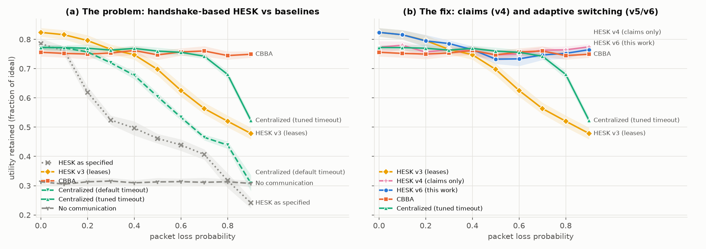
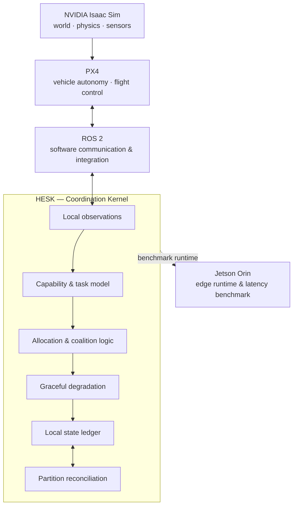

<div align="center">
  
# 🛸 HESK
### Heterogeneous Edge Swarm Consensus Kernel

[](https://github.com/DarshRajPandey/hesk)
[](https://www.python.org/)
[](LICENSE)
[](#system-invariants)

*A capability-aware coordination kernel for heterogeneous autonomous swarms operating through resource loss, network partitions, and changing team composition.*

<br/>

`brokerless` · `partition-tolerant` · `graceful degradation` · `capability-aware`

</div>

---

## 📖 The Core Thesis

Most swarm coordination becomes trivial if every robot is treated as interchangeable and networks are reliable. Real autonomous fleets are not interchangeable. 

> **How can a changing group of non-identical autonomous nodes preserve maximum mission utility as compute, energy, sensing, communication, and individual nodes progressively become unavailable?**

HESK is an attempt to make that question explicit, executable, and falsifiable. It treats the swarm not as a formation of identical drones, but as a **distributed resource system**. The objective is not to preserve every robot, but to preserve useful system capability as the swarm degrades.

---

## 🔬 Research Results — 11,690 reproducible experiments

HESK ships with a deterministic swarm simulator, five baselines and an automated experiment
grid. Every number below is a **paired comparison over identical fleets, missions and fault
schedules**, reproducible bit-for-bit (`make verify`). Full write-up:
**[docs/RESEARCH.md](docs/RESEARCH.md)** · plain-language guide:
**[docs/UNDERSTANDING_HESK.md](docs/UNDERSTANDING_HESK.md)**.

<p align="center"></p>

| Condition | HESK v6 vs **CBBA** | HESK v6 vs **centralized optimal dispatch** |
|---|---|---|
| Nominal | **+0.091** | **+0.064** |
| 30% packet loss | **+0.048** | **+0.090** |
| 90% packet loss | **+0.016** | **+0.457** |
| 2-way partition | **+0.040** | **+0.047** |
| Compound attack (bursty loss + partition + scarce kills + sensor failures) | **−0.021** ⚠️ | **+0.085** |

*Δ = fraction of ideal mission utility, bold = p < 0.01 (Wilcoxon, 20–30 paired seeds).
HESK v6 is the kernel plus the four fixes the experiments motivated.*

**What the experiments discovered** (each found by measurement, explained by a mechanism, and
confirmed by intervention):

1. 🕳️ **The scarcity guard had a back door.** Coalition formation drafted the only thermal
   drones as spare compute, starving critical search-and-rescue tasks. Fix: critical utility
   0.58 → 0.84.
2. 👻 **Under packet loss, the failure detector becomes the allocator.** False "node dead"
   suspicions evicted working owners 78× per mission. Leases fix it: +0.25 utility at 30% loss.
3. 🤝 **Transactions are what jamming kills.** Handshake-based allocation collapses with loss;
   state-based claims stay flat to 90% loss. But only transactions can form coalitions, so
   HESK v5/v6 switch per drone from a *local* loss estimate.
4. 🛰️ **A fixed timeout made HESK unusable over satellite links.** At ≥ 250 ms latency, no bid
   ever arrived and utility dropped from 0.84 to 0.05. Measured-RTT timeouts fix it.
5. 🧩 **Faults interact.** Every single fault favours HESK, but the compound attack doesn't:
   kills create repair work, and loss taxes repair.
6. 🧪 **Two reconciliation rules in Alg 008 never converge**, and the ownership cascade has no
   causal order (resurrects dead owners). Both are encoded as regression tests.

---

## 🎖️ Defense & Tactical Applications

HESK targets contested environments: electronic warfare, jamming and attrition. Each claim below
is marked with what the simulation study actually measured.

| Capability | Tactical advantage | Evidence |
| :--- | :--- | :--- |
| **EW resilience** | Sub-swarms fractured by jamming keep allocating locally without central consensus | ✅ Measured: v6 ≥ CBBA at every i.i.d. loss level, and +0.05 to +0.46 over centralized dispatch. ⚠️ Long correlated bursts (60% loss, 64-packet bursts) are still an open weakness |
| **Autonomous reconstitution** | When a high-value node is destroyed, survivors re-cover its tasks, via coalitions if needed | ✅ Measured, but ⚠️ under compound faults CBBA repairs faster (median 26 s vs 62 s) |
| **Attritable heterogeneity** | Tasks go to the most expendable capable drone, preserving scarce platforms | ✅ Measured: removing the scarcity term costs −0.108 utility |
| **Semantic information degradation** | Drop to compressed representations as bandwidth shrinks | 🔵 Design goal, not yet implemented |

---

## ⚡ Architectural Pillars & Invariants

HESK is governed by strict, non-negotiable architectural rules. No HESK node may read simulator-global truth to make an operational decision.

<table align="center">
  <tr>
    <td align="center" width="25%">
      📉<br/><b>Graceful Degradation</b><br/>Strategic suspension of secondary services to keep critical mission objectives alive.
    </td>
    <td align="center" width="25%">
      🧠<br/><b>Scarcity-Aware</b><br/>Task allocation accounts for the tactical opportunity-cost of using a specialized asset.
    </td>
    <td align="center" width="25%">
      🤝<br/><b>Dynamic Coalitions</b><br/>Instantaneous teaming of fragmented nodes to meet complex mission requirements.
    </td>
    <td align="center" width="25%">
      🌊<br/><b>CRDT Reconciliation</b><br/>Deterministic, vector-clock-driven conflict resolution when split-brain partitions merge.
    </td>
  </tr>
</table>

---

## 🛠️ Where HESK Sits

HESK is **not a flight controller** (PX4), **not a physics simulator** (Isaac Sim), and **not robotics middleware** (ROS 2). It sits above the vehicle autonomy layer to orchestrate complex tactical decisions.



---

## 🧬 The 8 Core Algorithms

HESK is specified algorithm-first. The architecture is decomposed into eight mathematically dependent algorithms. 

<details>
<summary><b>001 — Capability Model</b></summary>
<br/>
Defines the difference between hardware inventory and runtime capability. A node may physically contain a GPU while being thermally throttled or energy constrained. HESK reasons about <b>currently usable capability</b>, not a static parts list.
</details>

<details>
<summary><b>002 — Task Model</b></summary>
<br/>
Represents tasks as capability requirements, preferences, priorities, and degradation alternatives. The model asks what a task semantically needs instead of hard-coding a specific robot identity.
</details>

<details>
<summary><b>003 — Capability Matching</b></summary>
<br/>
Determines whether a node can execute a task from the state it is allowed to know. Required capabilities establish feasibility; preferred capabilities influence ranking.
</details>

<details>
<summary><b>004 — Scarcity-Aware Allocation</b></summary>
<br/>
Explores the opportunity cost of consuming rare capabilities via dynamic `theta` thresholding. The cheapest eligible node is not always the best assignment if it is the swarm's only provider of a critical future capability.
</details>

<details>
<summary><b>005 — Coalition Formation</b></summary>
<br/>
Investigates when multiple nodes can jointly satisfy a task that no individual node can execute. Solves <b>capability composition semantics</b> for divisible and indivisible resources.
</details>

<details>
<summary><b>006 — Graceful Degradation</b></summary>
<br/>
Attempts to preserve useful mission output when the ideal task becomes infeasible. Rather than treating capability loss as a binary failure, HESK searches for lower-cost alternative task strategies.
</details>

<details>
<summary><b>007 — Local State Ledger</b></summary>
<br/>
Because there is no global "truth" in a jammed environment, every node maintains a Local State Ledger governed by vector clocks, capturing causal histories of beliefs and observations without waiting for central consensus.
</details>

<details>
<summary><b>008 — Partition Reconciliation</b></summary>
<br/>
When a split-brain swarm reconnects, this CRDT algorithm deterministically merges state. Resolves dual-ownership conflicts based on task progress, match quality, and drift-guarded observation recency.
</details>

---

## 🧪 A HESK Failure Experiment

A representative operational scenario looks like this:

```text
                 50 heterogeneous nodes
                           │
                 tasks allocated locally
                           │
             ┌─────────────┴─────────────┐
             │                           │
        Partition α                 Partition β
             │                           │
     loses compute node          loses sensor node
             │                           │
     reallocates tasks           degrades mapping
             │                           │
     creates local state         creates local state
             └─────────────┬─────────────┘
                           │
                    network restored
                           │
                  contradictory claims
                           │
                semantic reconciliation
                           │
             swarm resumes with one state
```

The interesting questions are measurable: *How much mission utility survives? How quickly does the swarm recover? Do all nodes converge after delayed and reordered messages?*

---

## 📊 Evaluation Strategy

HESK uses a **multi-fidelity** evaluation plan to ensure algorithms are thoroughly falsified before physical deployment. 

| Scale | Environment | Purpose |
|---|---|---|
| **12–96 agents** ✅ | Lightweight HESK simulation (`src/hesk_sim`) | 11,690 Monte Carlo runs: loss, bursts, partitions, latency, attrition, ablation |
| **Multi-vehicle** | PX4 + ROS 2 | Vehicle-interface and multi-agent integration |
| **High-fidelity scenarios** | NVIDIA Isaac Sim | Physics, sensing, occlusion, heterogeneous embodied scenarios |
| **Edge runtime** | NVIDIA Jetson Orin | Decision latency, memory, local inference and runtime profiling |

> [!IMPORTANT]
> The simulator may know the global state **only to score the experiment**. HESK nodes operate exclusively on local knowledge. This separation is essential to prevent accidentally making a distributed algorithm appear smarter than it is.

---

## 📂 Repository Structure

```text
hesk/
├── src/hesk/                 # 🧠 Coordination kernel (Algorithms 001-008)
│   ├── capabilities/         #    capability model + matching          (001, 003)
│   ├── tasks/                #    task model + scarcity-aware auction  (002, 004)
│   ├── coalitions/           #    multi-drone coalition formation      (005)
│   ├── degradation/          #    tier descent and cascades            (006)
│   └── ledger/               #    local ledger + reconciliation        (007, 008)
│
├── src/hesk_sim/             # 🧪 Research harness
│   ├── engine.py             #    deterministic discrete-event core, seeded RNG streams
│   ├── network.py            #    lossy / bursty / partitionable broadcast radio
│   ├── world.py              #    ground truth, faults, scoring (never read by agents)
│   ├── agents/               #    HESK runtime, CBBA, centralized, Contract Net, oracle, no-comm
│   ├── suites.py             #    12 experiment families → 11,690 runs
│   ├── cli.py                #    parallel, resumable runner
│   └── analyze.py            #    bootstrap CIs, paired Wilcoxon tests, figures
│
├── docs/
│   ├── RESEARCH.md           # 📄 the study: method, 10 findings, threats to validity
│   ├── UNDERSTANDING_HESK.md # 📘 plain-language explanation
│   ├── ROADMAP.md            # 🛰️ compute budget, scaling, path to hardware
│   └── algorithms/           # specs for Algs 001-008
│
├── results/                  # 📊 figures, summary tables, raw run records (gzipped JSONL)
├── scripts/                  # reproducibility verifier
├── tests/                    # kernel unit tests + harness tests + kernel-finding regressions
└── Makefile                  # test · smoke · reproduce · analyze · verify
```

---

## 📈 Current Status

<div align="center">

| Kernel | Simulation | Baselines | Experiments | Hardware | Jetson profiling |
|:---:|:---:|:---:|:---:|:---:|:---:|
| 🟢 v6 | 🟢 Done | 🟢 5 + oracle | 🟢 11,690 runs | 🔵 Planned | 🔵 Planned |

</div>

Next: fix kernel findings K1/K2 upstream in `src/hesk/ledger`, add range-limited multi-hop radio,
then software-in-the-loop (PX4 + ROS 2) and a tabletop hardware validation. See
[docs/ROADMAP.md](docs/ROADMAP.md).

---

## 🧠 Development Philosophy

> **Write the invariant. Attack the assumption. Build the smallest counterexample. Then write the code.**

HESK deliberately avoids placeholder abstractions like `OptimalAllocator()` or `IntelligentRecoveryManager()` unless the decision logic behind them is explicitly mathematically defined. The repository prefers a small algorithm with a documented limitation over a large codebase that only looks complete.

---

## 🚀 Getting Started

HESK is written in modern Python and is designed to run locally on companion computers with minimal dependencies.

```bash
# Clone the repository
git clone https://github.com/DarshRajPandey/hesk.git
cd hesk

# Create a virtual environment
python -m venv .venv
source .venv/bin/activate

# Install the HESK package in editable mode
pip install -e .[dev,analysis]
```

### Reproducing the study

```bash
pip install -e '.[dev,analysis]'
make test        # kernel + harness tests (~1 min)
make verify      # re-run 24 random published runs, check bit-exact match
make smoke       # every experiment family with 1 seed (~10 min)
make reproduce   # all 11,690 runs (~4-5 h on 4 cores; ~20 min on a 64-vCPU VM)
make analyze     # tables + figures into results/

# one run, any condition
python -m hesk_sim.cli one --algo hesk6 --seed 7 --set loss=0.4 kill_frac=0.3
```

> [!WARNING]
> HESK is a research prototype. Do not connect experimental coordination logic directly to safety-critical actuators without an independently validated control and safety layer.

<br/>
<div align="center">
  <i>Preserve capability, not uniformity.</i>
</div>