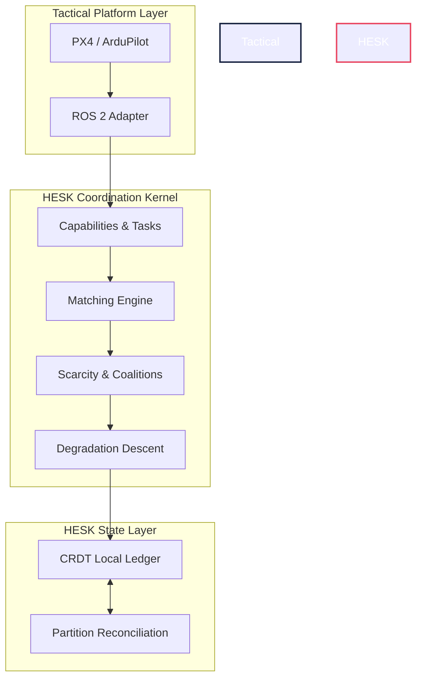

<div align="center">
  
# 🚁 HESK
### Heterogeneous Edge Swarm Consensus Kernel

[](https://github.com/DarshRajPandey/hesk)
[](https://www.python.org/downloads/)
[](https://opensource.org/licenses/MIT)

*A decentralized coordination engine for heterogeneous autonomous systems operating in highly contested, communication-denied, and resource-constrained environments.*

</div>

<br/>

> **The HESK Thesis:** How can a dynamic group of non-identical autonomous nodes preserve maximum mission utility as compute, energy, communication, and individual units are progressively lost in the field?

HESK rejects the standard assumption that swarm units are identical and networks are reliable. Instead, it serves as a resilient, brokerless brain sitting above the flight-controller layer (e.g., PX4, ArduPilot) to orchestrate complex tactical decisions when conditions deteriorate.

---

## 🎖️ Defense & Tactical Applications

HESK was fundamentally architected to address the realities of modern electronic warfare and contested domains. By prioritizing mathematically verifiable resilience over fragile centralization, HESK provides robust capabilities for defense applications:

| Capability | Tactical Advantage |
| :--- | :--- |
| **Electronic Warfare (EW) Resilience** | Operates exclusively on mathematically reconciled Local State Ledgers. If a swarm is fractured by jamming, sub-swarms continue executing their local missions independently. |
| **Autonomous Reconstitution** | If a high-value ISR node is destroyed, HESK autonomously forms distributed capability-coalitions from surviving nodes to reconstruct the lost sensor coverage. |
| **Semantic Information Degradation** | As bandwidth is throttled or jammed, HESK strategically drops high-bandwidth data (e.g., raw LiDAR) in favor of hyper-compressed semantic representations (e.g., coordinate points), ensuring critical targeting data always penetrates. |
| **Attritable Heterogeneity** | Seamlessly mixes high-capability assets (Heavy Lift/Compute) with low-cost attritable drones. Tasks are mapped to the most expendable node capable of execution, preserving scarce capabilities. |

---

## ⚡ Architectural Pillars

<table align="center">
  <tr>
    <td align="center" width="25%">
      📉<br/><b>Graceful Degradation</b><br/>Strategic suspension of secondary services to keep critical mission objectives alive.
    </td>
    <td align="center" width="25%">
      🧠<br/><b>Scarcity-Aware</b><br/>Task allocation accounts for the tactical opportunity-cost of using a specialized asset.
    </td>
    <td align="center" width="25%">
      🤝<br/><b>Dynamic Coalitions</b><br/>Instantaneous teaming of fragmented nodes to meet complex mission requirements.
    </td>
    <td align="center" width="25%">
      🌊<br/><b>CRDT Reconciliation</b><br/>Deterministic, vector-clock-driven conflict resolution when split-brain partitions merge.
    </td>
  </tr>
</table>

---

## 🧬 The 8 Core Algorithms

HESK relies on a mathematically rigorous foundation of 8 core algorithms. 

<details>
<summary><b>1️⃣ Capability & Task Modeling (Algorithms 001–003)</b></summary>
<br/>
Abstracts away rigid hardware identities. Tasks have specific capability requirements, and nodes broadcast real-time vectors that account for tactical wear, thermal throttling, and battery drain.
</details>

<details>
<summary><b>2️⃣ Scarcity & Coalition Allocation (Algorithms 004–005)</b></summary>
<br/>
Assigns tasks optimally based on dynamic `theta` thresholds. If no single node can accomplish an objective, HESK dynamically recruits and chains a temporary tactical coalition of surviving nodes.
</details>

<details>
<summary><b>3️⃣ Graceful Degradation (Algorithm 006)</b></summary>
<br/>
Implements continuous descent mechanisms. Rather than aborting a mission when processing power drops, HESK degrades the objective (e.g., from dense 3D mapping to sparse 2D mapping) to ensure operational continuation.
</details>

<details>
<summary><b>4️⃣ Local State Ledger & CRDTs (Algorithm 007)</b></summary>
<br/>
Because there is no global "truth" in a jammed environment, every node maintains a Local State Ledger governed by vector clocks, capturing causal histories of beliefs and observations without waiting for central consensus.
</details>

<details>
<summary><b>5️⃣ Partition Reconciliation (Algorithm 008)</b></summary>
<br/>
When a split-brain swarm reconnects, this CRDT algorithm deterministically merges state. Resolves dual-ownership conflicts based on task progress, match quality, and drift-guarded observation recency.
</details>

---

## 🛠️ System Architecture



---

## 🚀 Installation & Setup

HESK is written in modern Python and is designed to run locally on companion computers (e.g., Jetson, Raspberry Pi) with minimal dependencies.

```bash
# Clone the repository
git clone https://github.com/DarshRajPandey/hesk.git
cd hesk

# Create a virtual environment
python -m venv .venv
source .venv/bin/activate

# Install the HESK package in editable mode
pip install -e .
```

### Running the Test Suite
The testing suite includes 29 adversarial tests verifying CRDT convergence, scarcity math, and reconciliation cascades.

```bash
pip install pytest
pytest tests/unit/
```

---

<div align="center">
  <i>HESK is designed for the edge. When the network goes down, the swarm adapts.</i>
</div>