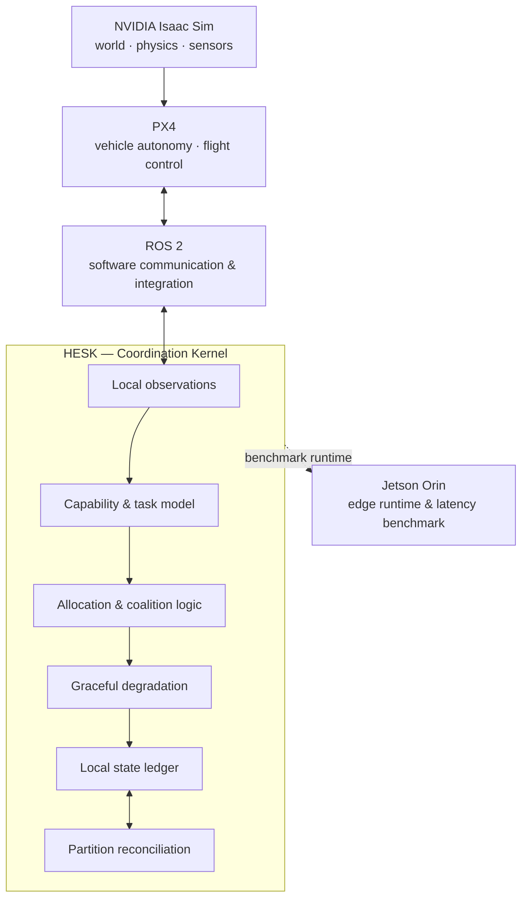

<div align="center">
  
# 🛸 HESK
### Heterogeneous Edge Swarm Consensus Kernel

[](https://github.com/DarshRajPandey/hesk)
[](https://www.python.org/)
[](LICENSE)
[](#system-invariants)

*A capability-aware coordination kernel for heterogeneous autonomous swarms operating through resource loss, network partitions, and changing team composition.*

<br/>

`brokerless` · `partition-tolerant` · `graceful degradation` · `capability-aware`

</div>

---

## 📖 The Core Thesis

Most swarm coordination becomes trivial if every robot is treated as interchangeable and networks are reliable. Real autonomous fleets are not interchangeable. 

> **How can a changing group of non-identical autonomous nodes preserve maximum mission utility as compute, energy, sensing, communication, and individual nodes progressively become unavailable?**

HESK is an attempt to make that question explicit, executable, and falsifiable. It treats the swarm not as a formation of identical drones, but as a **distributed resource system**. The objective is not to preserve every robot, but to preserve useful system capability as the swarm degrades.

---

## 🎖️ Defense & Tactical Applications

HESK was fundamentally architected to address the realities of modern electronic warfare (EW) and contested domains. By prioritizing mathematically verifiable resilience over fragile centralization, HESK provides robust capabilities for defense applications:

| Capability | Tactical Advantage |
| :--- | :--- |
| **Electronic Warfare (EW) Resilience** | Operates exclusively on mathematically reconciled Local State Ledgers. If a swarm is fractured by jamming, sub-swarms continue executing their local missions independently without waiting for central consensus. |
| **Autonomous Reconstitution** | If a high-value ISR node is destroyed, HESK autonomously forms distributed capability-coalitions from surviving nodes to reconstruct the lost sensor coverage. |
| **Semantic Information Degradation** | As bandwidth is throttled or jammed, HESK strategically drops high-bandwidth data in favor of hyper-compressed semantic representations (e.g., coordinate points), ensuring critical targeting data always penetrates. |
| **Attritable Heterogeneity** | Seamlessly mixes high-capability assets (Heavy Compute/Sensors) with low-cost attritable drones. Tasks are mapped to the most expendable node capable of execution, preserving scarce capabilities. |

---

## ⚡ Architectural Pillars & Invariants

HESK is governed by strict, non-negotiable architectural rules. No HESK node may read simulator-global truth to make an operational decision.

<table align="center">
  <tr>
    <td align="center" width="25%">
      📉<br/><b>Graceful Degradation</b><br/>Strategic suspension of secondary services to keep critical mission objectives alive.
    </td>
    <td align="center" width="25%">
      🧠<br/><b>Scarcity-Aware</b><br/>Task allocation accounts for the tactical opportunity-cost of using a specialized asset.
    </td>
    <td align="center" width="25%">
      🤝<br/><b>Dynamic Coalitions</b><br/>Instantaneous teaming of fragmented nodes to meet complex mission requirements.
    </td>
    <td align="center" width="25%">
      🌊<br/><b>CRDT Reconciliation</b><br/>Deterministic, vector-clock-driven conflict resolution when split-brain partitions merge.
    </td>
  </tr>
</table>

---

## 🛠️ Where HESK Sits

HESK is **not a flight controller** (PX4), **not a physics simulator** (Isaac Sim), and **not robotics middleware** (ROS 2). It sits above the vehicle autonomy layer to orchestrate complex tactical decisions.



---

## 🧬 The 8 Core Algorithms

HESK is specified algorithm-first. The architecture is decomposed into eight mathematically dependent algorithms. 

<details>
<summary><b>001 — Capability Model</b></summary>
<br/>
Defines the difference between hardware inventory and runtime capability. A node may physically contain a GPU while being thermally throttled or energy constrained. HESK reasons about <b>currently usable capability</b>, not a static parts list.
</details>

<details>
<summary><b>002 — Task Model</b></summary>
<br/>
Represents tasks as capability requirements, preferences, priorities, and degradation alternatives. The model asks what a task semantically needs instead of hard-coding a specific robot identity.
</details>

<details>
<summary><b>003 — Capability Matching</b></summary>
<br/>
Determines whether a node can execute a task from the state it is allowed to know. Required capabilities establish feasibility; preferred capabilities influence ranking.
</details>

<details>
<summary><b>004 — Scarcity-Aware Allocation</b></summary>
<br/>
Explores the opportunity cost of consuming rare capabilities via dynamic `theta` thresholding. The cheapest eligible node is not always the best assignment if it is the swarm's only provider of a critical future capability.
</details>

<details>
<summary><b>005 — Coalition Formation</b></summary>
<br/>
Investigates when multiple nodes can jointly satisfy a task that no individual node can execute. Solves <b>capability composition semantics</b> for divisible and indivisible resources.
</details>

<details>
<summary><b>006 — Graceful Degradation</b></summary>
<br/>
Attempts to preserve useful mission output when the ideal task becomes infeasible. Rather than treating capability loss as a binary failure, HESK searches for lower-cost alternative task strategies.
</details>

<details>
<summary><b>007 — Local State Ledger</b></summary>
<br/>
Because there is no global "truth" in a jammed environment, every node maintains a Local State Ledger governed by vector clocks, capturing causal histories of beliefs and observations without waiting for central consensus.
</details>

<details>
<summary><b>008 — Partition Reconciliation</b></summary>
<br/>
When a split-brain swarm reconnects, this CRDT algorithm deterministically merges state. Resolves dual-ownership conflicts based on task progress, match quality, and drift-guarded observation recency.
</details>

---

## 🧪 A HESK Failure Experiment

A representative operational scenario looks like this:

```text
                 50 heterogeneous nodes
                           │
                 tasks allocated locally
                           │
             ┌─────────────┴─────────────┐
             │                           │
        Partition α                 Partition β
             │                           │
     loses compute node          loses sensor node
             │                           │
     reallocates tasks           degrades mapping
             │                           │
     creates local state         creates local state
             └─────────────┬─────────────┘
                           │
                    network restored
                           │
                  contradictory claims
                           │
                semantic reconciliation
                           │
             swarm resumes with one state
```

The interesting questions are measurable: *How much mission utility survives? How quickly does the swarm recover? Do all nodes converge after delayed and reordered messages?*

---

## 📊 Evaluation Strategy

HESK uses a **multi-fidelity** evaluation plan to ensure algorithms are thoroughly falsified before physical deployment. 

| Scale | Environment | Purpose |
|---|---|---|
| **10–1,000 agents** | Lightweight HESK simulation | Monte Carlo failure sweeps, partitions, allocation and convergence |
| **Multi-vehicle** | PX4 + ROS 2 | Vehicle-interface and multi-agent integration |
| **High-fidelity scenarios** | NVIDIA Isaac Sim | Physics, sensing, occlusion, heterogeneous embodied scenarios |
| **Edge runtime** | NVIDIA Jetson Orin | Decision latency, memory, local inference and runtime profiling |

> [!IMPORTANT]
> The simulator may know the global state **only to score the experiment**. HESK nodes operate exclusively on local knowledge. This separation is essential to prevent accidentally making a distributed algorithm appear smarter than it is.

---

## 📂 Repository Structure

```text
hesk/
│
├── docs/                     # Architectural guides and algorithm specifications
│   ├── HESK_SCOPE.md         # The core thesis and system boundary
│   ├── CONSTRUCTION_GUIDE.md # Mandatory builder invariants & pitfalls
│   └── algorithms/           # Detailed specs for Algs 001–008
│
├── src/hesk/                 # 🧠 Core Kernel Source Code
│   ├── capabilities/         # Capability vectors, requirements, and matching
│   ├── coalitions/           # Divisible and indivisible capability pooling
│   ├── degradation/          # Service descent and cascade rules
│   ├── ledger/               # CRDTs, Vector Clocks, and Reconciliation
│   ├── tasks/                # Scarcity-aware task allocation
│   └── core/                 # Shared types and primitives
│
├── simulation/               # (WIP) Integration testing and environment
├── tests/                    # 100% Coverage Unit & Adversarial Tests
└── README.md
```

---

## 📈 Current Status

<div align="center">

| Architecture | Algorithms | Core implementation | Simulation | Jetson profiling |
|:---:|:---:|:---:|:---:|:---:|
| 🟢 Active | 🟡 Audit | 🟡 Prototype | 🔵 Planned | 🔵 Planned |

</div>

HESK is currently in an **algorithm-first research and prototyping phase**. The immediate priority is removing weak assumptions before they become implementation dependencies—particularly around event identity, observer-relative state, and convergent partition reconciliation.

---

## 🧠 Development Philosophy

> **Write the invariant. Attack the assumption. Build the smallest counterexample. Then write the code.**

HESK deliberately avoids placeholder abstractions like `OptimalAllocator()` or `IntelligentRecoveryManager()` unless the decision logic behind them is explicitly mathematically defined. The repository prefers a small algorithm with a documented limitation over a large codebase that only looks complete.

---

## 🚀 Getting Started

HESK is written in modern Python and is designed to run locally on companion computers with minimal dependencies.

```bash
# Clone the repository
git clone https://github.com/DarshRajPandey/hesk.git
cd hesk

# Create a virtual environment
python -m venv .venv
source .venv/bin/activate

# Install the HESK package in editable mode
pip install -e .
```

### Running the Test Suite
The testing suite includes 29 adversarial tests verifying CRDT convergence, scarcity math, and reconciliation cascades.

```bash
pip install pytest
pytest tests/unit/
```

> [!WARNING]
> HESK is a research prototype. Do not connect experimental coordination logic directly to safety-critical actuators without an independently validated control and safety layer.

<br/>
<div align="center">
  <i>Preserve capability, not uniformity.</i>
</div>