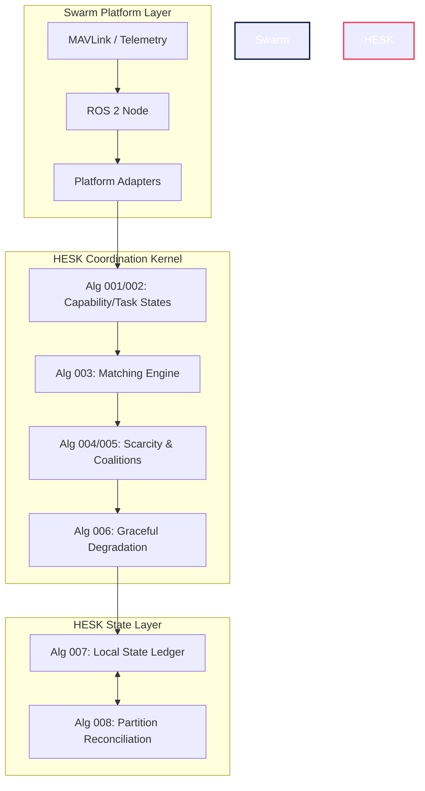

<div align="center">
  
# 🛸 HESK
### Heterogeneous Edge Swarm Consensus Kernel

[](https://github.com/DarshRajPandey/hesk)
[](https://www.python.org/downloads/)
[](https://opensource.org/licenses/MIT)
[]()

*A brokerless coordination kernel for autonomous, heterogeneous multi-agent swarms operating under severe communication degradation and compounding resource loss.*

</div>

---

## 📖 The Core Thesis

> **How can a changing group of non-identical autonomous nodes preserve maximum mission utility as compute, energy, communication, sensors, and individual nodes progressively become unavailable?**

Most swarm software assumes identical units and reliable networks. **HESK rejects this.** In the real world, a swarm consists of nodes with varying payloads, degrading batteries, differing computational power, and intermittent connectivity. 

HESK is **not** a flight controller. It sits above MAVLink and ROS 2 as the **brain** of the swarm, deciding *what* should happen, while leaving the *how* to individual platform autonomy stacks.

---

## ⚡ Architectural Pillars

| Pillar | Description |
| :--- | :--- |
| **📉 Graceful Degradation** | Rather than failing entirely, HESK strategically abandons non-essential capabilities while preserving critical mission services. |
| **🧠 Scarcity-Aware Allocation** | Assigns tasks based not just on immediate cost, but on the *opportunity cost* of consuming a systemically scarce capability. |
| **🤝 Coalition Formation** | If a node dies, HESK dynamically recruits a temporary team of surviving nodes to reconstruct the lost capability. |
| **🌊 Partition Reconciliation** | Partitions are treated as normal operation. Ledgers use deterministic CRDT math to gracefully resolve state conflicts when sub-swarms merge. |
| **🛡️ Brokerless Operation** | No central manager. No single point of failure. Every node operates exclusively on local observations and mathematically reconciled ledgers. |

---

## 🧬 The 8 Core Algorithms

HESK is built upon 8 hardened, mathematically verified, adversarial-tested algorithms.

<details>
<summary><b>1️⃣ Capability & Task Modeling (Algorithms 001–003)</b></summary>
Abstracts away rigid hardware identities. Tasks have specific requirements (e.g., <i>"requires visual sensing > 0.7, prefers LiDAR"</i>) and nodes broadcast real-time capability vectors that account for thermal throttling and battery drain.
</details>

<details>
<summary><b>2️⃣ Scarcity & Coalition Allocation (Algorithms 004–005)</b></summary>
Calculates dynamic `theta` thresholds to evaluate how rare a capability is across the swarm. Assigns tasks optimally. When single nodes can't complete a task, forms temporary, distributed coalitions that pool fragmented resources.
</details>

<details>
<summary><b>3️⃣ Graceful Degradation (Algorithm 006)</b></summary>
Implements continuous descent mechanisms. If high-bandwidth 3D mapping becomes impossible, HESK automatically degrades the task to sparse 2D mapping to preserve mission utility rather than throwing an error.
</details>

<details>
<summary><b>4️⃣ Local State Ledger & CRDTs (Algorithm 007)</b></summary>
Because there is no global "truth", every node runs a Local State Ledger governed by vector clocks, capturing causal histories of beliefs and observations without waiting for network consensus.
</details>

<details>
<summary><b>5️⃣ Partition Reconciliation (Algorithm 008)</b></summary>
When a split-brain swarm reconnects, this algorithm deterministically merges state. Resolves dual-ownership conflicts based on task progress, match quality, and drift-guarded observation recency.
</details>

---

## 🛠️ System Architecture



---

## 📂 Repository Structure

```text
hesk/
├── docs/                     # Architectural guides and algorithm specifications
│   ├── CONSTRUCTION_GUIDE.md # Mandatory builder invariants & pitfalls
│   ├── HESK_SCOPE.md         # The core thesis and system boundary
│   └── algorithms/           # Detailed specs for Algs 001–008
├── src/hesk/                 # 🧠 Core Kernel Source Code
│   ├── capabilities/         # Capability vectors, requirements, and matching
│   ├── coalitions/           # Divisible and indivisible capability pooling
│   ├── core/                 # Shared types, Node IDs
│   ├── degradation/          # Service descent and cascade rules
│   ├── ledger/               # CRDTs, Vector Clocks, and Reconciliation
│   └── tasks/                # Scarcity-aware task allocation
├── simulation/               # (WIP) Integration testing and environment
└── tests/                    # 100% Coverage Unit & Adversarial Tests
```

---

## 🚀 Getting Started

HESK is written in pure, modern Python and requires zero external dependencies for its core logic layer.

### Installation

```bash
# Clone the repository
git clone https://github.com/DarshRajPandey/hesk.git
cd hesk

# Create a virtual environment
python -m venv .venv
source .venv/bin/activate

# Install the package in editable mode
pip install -e .
```

### Running Tests
The testing suite includes 29 adversarial tests verifying CRDT convergence, scarcity math, and reconciliation cascades.

```bash
pip install pytest
pytest tests/unit/
```

---

## ⚠️ Important Disclaimer
*This repository represents a theoretical coordination architecture.* It is built to investigate state management, capability decay, and multi-agent coordination mathematics. **Do not connect this directly to drone motors or flight controllers without intermediate safety guardrails.** 

> *"A 2,000-line repository demonstrating one strong systems idea is more valuable than a 40,000-line fake operating system."* — *The HESK Construction Guide*

<br/>
<div align="center">
  <b>Designed for the Edge. Built for the Unknown.</b>
</div>